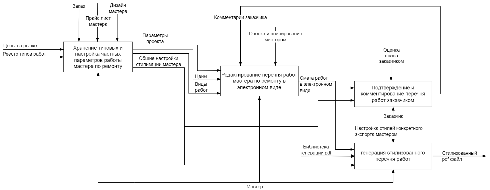

# Второй модуль gb

## Базовые принципы проектирования. Объектно-ориентированное проектирование ПО

## Описание проекта

Web сервис по работе со сметами ремонтных работ. Их оформлению и отправки заказчику.
Мастер добавляет проект, указывает заказчика. У проекта может быть несколько объектов, например различные комнаты или адреса. В рамках проекта создаются сметы работ, которые мастер может экспортировать в стилизованные pdf файлы и генерировать открытые для заказчика ссылки на сметы, где тот их может прокомментировать и утвердить.

## UML-диаграмма прецедентов (Use Case Diagram).

## Функциональная диаграмма (IDEF0).

## Диаграмма потоков данных (DFD) в нотации Йордана.

.png)

## UML-диаграмма компонентов (Component Diagram)

## UML-диаграммы классов (Class Diagram)

### Компонент PDFExporter

### Компонент ProjectManagerEntity

## UML-диаграмма последовательности (Sequence Diagram)

Для прецедента, когда мастер экспортирует PDF файл и общается напрямую с заказчиком:

Для прецедента, когда заказчик комментирует и подтвержает смету онлайн, на портале:

